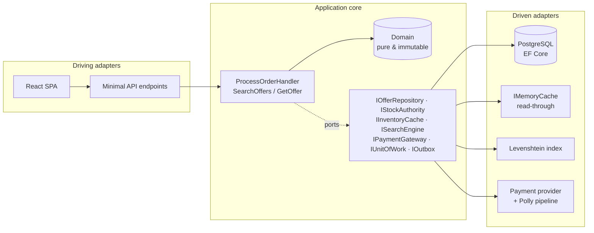

# FLASH//MKT — Flash Sales Marketplace

A hyper-concurrent flash-sales marketplace built as a senior-level technical showcase:
**.NET 10 + Hexagonal Architecture (Ports & Adapters)** on the backend, **React 19 + TypeScript + Vite** on the frontend, with strict TDD, architecture guardrails, Polly v8 resilience, CQRS-ready persistence, and end-to-end observability via OpenTelemetry.

```
 Catalog & search (read side)              Checkout (write side)
 ────────────────────────────              ─────────────────────
 in-memory fuzzy index  ←──┐               JWT-protected endpoint
 read-through stock cache  │ committed     → validation chain (CoR)
 no-tracking projections   │ stock events  → atomic conditional UPDATE  ← no overselling
                           └───────────────→ Polly-wrapped payment
                                            → confirm or compensate
```

## Quick start

```bash
# 1. Infrastructure
docker compose up -d postgres            # + `--profile observability` for Jaeger UI

# 2. Backend  (http://localhost:5038)
cd backend
dotnet test                              # 53 unit + 9 architecture tests, no Docker needed
dotnet test tests/FlashSales.IntegrationTests   # 13 tests, Testcontainers (needs Docker)
dotnet run --project src/FlashSales.Api

# 3. Frontend (http://localhost:5173, /api proxied to 5038)
cd ../frontend
npm install && npm run dev
```

Demo users: `demo / demo123` · `admin / admin123`.
Demo coupons: `FLASH10`, `VIP20`.
Demo payment methods: `CreditCard` (ok), `DeclinedCard` (hard decline → compensation), `FlakyCard` (provider outage → retry + circuit breaker).

## Solution structure

```
flash-sales-marketplace/
├── docker-compose.yml                  # postgres:17-alpine (+ jaeger, optional)
├── backend/
│   ├── src/
│   │   ├── FlashSales.SharedKernel/    # Money, Error, Result<T>, SellerTier — zero deps
│   │   ├── FlashSales.Domain/          # PURE: → SharedKernel only
│   │   │   ├── Catalog/Offer.cs        # immutable aggregate, Result-based transitions
│   │   │   └── Ordering/               # Order, OrderLine, OrderPricing (pure fn)
│   │   │       └── Commissions/        # Strategy: Standard 10% / Premium 5%
│   │   │       # Catalog ↮ Ordering: contexts isolated by architecture tests
│   │   ├── FlashSales.Application/     # → Domain only
│   │   │   ├── Ports/                  # IOfferRepository, IStockAuthority, IInventoryCache,
│   │   │   │                           # ISearchEngine, IPaymentGateway, IUnitOfWork, IOutbox…
│   │   │   ├── Contracts/              # CQRS read DTOs, payment contracts, domain EVENTS
│   │   │   └── UseCases/ProcessOrder/  # handler + Chain of Responsibility steps
│   │   ├── FlashSales.Infrastructure/  # → Application (adapters)
│   │   │   ├── Persistence/            # EF Core + Npgsql (inventory/ordering schemas), UoW
│   │   │   ├── Outbox/                 # transactional outbox + dispatcher (read-model relay)
│   │   │   ├── Caching/                # read-through IMemoryCache inventory adapter
│   │   │   ├── Search/                 # Levenshtein engine + startup index hydration
│   │   │   └── Payments/               # simulated provider + Polly v8 decorator
│   │   └── FlashSales.Api/             # → composition root (driving adapter)
│   │       ├── Endpoints/              # auth / catalog (reads) / checkout (writes)
│   │       ├── Middleware/             # CorrelationIdMiddleware
│   │       └── Extensions/             # JWT, bulkhead rate limiter, OpenTelemetry, seeding
│   └── tests/
│       ├── FlashSales.UnitTests/          # 53 tests — TDD red/green/refactor
│       ├── FlashSales.ArchitectureTests/  # 9 NetArchTest guardrails (layers + contexts)
│       └── FlashSales.IntegrationTests/   # 13 tests — WebApplicationFactory + Testcontainers
└── frontend/                           # npm workspaces — microfrontend-ready seams
    ├── apps/web/                       # the SPA shell: pages (React.lazy), molecules,
    │                                   # organisms, Layout, router
    ├── packages/design-system/         # @flashmkt/design-system: tokens + atoms
    └── packages/app-kernel/            # @flashmkt/app-kernel: typed API contract,
                                        # correlation-id fetch client, JWT auth
```

## Architecture



**Dependency rule (enforced by tests):** `Api → Infrastructure → Application → Domain`, never the reverse. The Domain has *zero* dependencies; the Application knows only ports.

### CQRS-ready by construction

| | Reads (catalog/search) | Writes (checkout) |
|---|---|---|
| Model | `OfferSummary` flat DTOs | `Offer` / `Order` aggregates |
| Store | in-memory index + cache, `AsNoTracking` projections | PostgreSQL (`inventory`/`ordering` schemas), transactional |
| Consistency | eventual: **transactional outbox** projects `OfferStockChanged` events onto cache + index | strict (atomic conditional UPDATE + idempotency keys) |
| Scale path | Redis / Elasticsearch adapters | partitioned Postgres / event sourcing |

The write side already emits explicit, versionable domain events through a
transactional outbox; pointing the dispatcher at a message broker (instead of
the in-process read models) is the entire microservices migration of this seam.

---

## Deliverable showcase

### 1 · Fuzzy search behind a swappable port

The port lives in the Application layer; today's adapter is an in-memory Levenshtein engine. Swapping to Elasticsearch/Meilisearch = one new adapter + one DI line. ([ISearchEngine.cs](backend/src/FlashSales.Application/Ports/ISearchEngine.cs), [LevenshteinSearchEngine.cs](backend/src/FlashSales.Infrastructure/Search/LevenshteinSearchEngine.cs))

```csharp
public interface ISearchEngine
{
    IReadOnlyList<OfferSummary> Search(string query, int maxDistance = 2, int limit = 20);
    void Index(OfferSummary offer);
    void Remove(Guid offerId);
}

// Two-row DP Levenshtein over normalized (lowercase, diacritic-free) tokens,
// stackalloc'd — zero heap allocations per comparison:
private static int Levenshtein(ReadOnlySpan<char> a, ReadOnlySpan<char> b)
{
    Span<int> previous = stackalloc int[b.Length + 1];
    Span<int> current  = stackalloc int[b.Length + 1];
    /* ... classic dynamic programming ... */
}
```

`GET /api/catalog/search?q=nintnedo` → finds "Nintendo Switch 2".

### 2 · Resilience pipeline + inventory cache

The payment adapter is a decorator: retry (exponential backoff **+ jitter**) → circuit breaker → strict per-attempt timeout. Exhausted policies surface as a failed `PaymentResult`, so checkout compensates through its normal path instead of leaking exceptions. ([ResilientPaymentGateway.cs](backend/src/FlashSales.Infrastructure/Payments/ResilientPaymentGateway.cs))

```csharp
new ResiliencePipelineBuilder<PaymentResult>()
    .AddRetry(new() { MaxRetryAttempts = 3, BackoffType = DelayBackoffType.Exponential,
                      UseJitter = true, Delay = options.RetryBaseDelay,
                      ShouldHandle = transientFailures })
    .AddCircuitBreaker(new() { FailureRatio = 0.5, MinimumThroughput = 5,
                               BreakDuration = TimeSpan.FromSeconds(15), ... })
    .AddTimeout(options.AttemptTimeout)
    .Build();
```

**Bulkhead isolation** happens at the entry adapter: the checkout endpoint group owns a dedicated concurrency budget, so a search/catalog flood can never starve billing ([RateLimitingExtensions.cs](backend/src/FlashSales.Api/Extensions/RateLimitingExtensions.cs)):

```csharp
limiter.AddConcurrencyLimiter("checkout", o => { o.PermitLimit = 10; o.QueueLimit = 20; });
// catalog/search endpoints: unlimited — saturation there cannot stop invoicing
```

**Inventory cache** (read-through / cache-aside): stock reads are served from process memory in microseconds; only a miss touches Postgres; committed stock changes reach the cache through the outbox-projected `OfferStockChanged` events ([InMemoryInventoryCache.cs](backend/src/FlashSales.Infrastructure/Caching/InMemoryInventoryCache.cs), [OutboxDispatcher.cs](backend/src/FlashSales.Infrastructure/Outbox/OutboxDispatcher.cs)).

### 3 · ProcessOrder — TDD + Chain of Responsibility + functional core

Grown test-first (see git history): cache fail-fast → fraud rules → coupons → atomic reservation → payment → compensation. The chain folds over `Result.Bind`, so the handler has no nested branching. ([ProcessOrderHandler.cs](backend/src/FlashSales.Application/UseCases/ProcessOrder/ProcessOrderHandler.cs))

```csharp
// Chain of Responsibility folded over Result.Bind: first failure wins.
var current = Result<OrderContext>.Success(context);
foreach (var step in validationChain)
    current = await current.BindAsync(ctx => step.HandleAsync(ctx, ct));
```

All order math is a pure function with cyclomatic complexity 1 ([OrderPricing.cs](backend/src/FlashSales.Domain/Ordering/OrderPricing.cs)):

```csharp
var subtotal  = lines.Aggregate(Money.Zero(currency), (acc, line) => acc + line.Subtotal);
var netAmount = subtotal - Min(discount, subtotal);
return new OrderTotals(subtotal, ..., Total: netAmount + netAmount.ApplyRate(taxRate),
                       Commission: commissionStrategy.Calculate(netAmount), ...);
```

**Why no overselling is possible** — the only stock mutation is an atomic conditional update; there is no read-modify-write window for two buyers to share ([OfferRepository.cs](backend/src/FlashSales.Infrastructure/Persistence/OfferRepository.cs)):

```sql
WITH updated AS (
    UPDATE offers SET stock = stock - @qty
    WHERE id = @id AND stock >= @qty      -- refuses once stock runs out
    RETURNING stock
) SELECT stock FROM updated;              -- null ⇒ oversell prevented
```

The integration suite proves it: 20 parallel checkouts against stock 5 → **exactly 5 succeed**, DB ends at 0 (`ParallelCheckouts_NeverOversell_ExactlyStockManySucceed`).

### 4 · Architecture tests (CI guardrails)

([HexagonalArchitectureTests.cs](backend/tests/FlashSales.ArchitectureTests/HexagonalArchitectureTests.cs)) — the build fails the moment someone violates the dependency rule:

```csharp
[Fact]
public void Domain_Should_Be_Pure_No_Framework_Or_Persistence_Dependencies()
{
    var result = Types.InAssembly(DomainAssembly)
        .ShouldNot().HaveDependencyOnAny(
            "Microsoft.EntityFrameworkCore", "Npgsql", "Polly",
            "Microsoft.AspNetCore", "Microsoft.Extensions")
        .GetResult();

    result.IsSuccessful.Should().BeTrue(BuildFailureMessage(result));
}
```

### 5 · Correlation-ID end to end

Frontend mints a UUID per request ([client.ts](frontend/packages/app-kernel/src/api/client.ts)); the middleware echoes it, tags the OTel span, and scopes every log line ([CorrelationIdMiddleware.cs](backend/src/FlashSales.Api/Middleware/CorrelationIdMiddleware.cs)):

```csharp
context.Items[ItemKey] = correlationId;
context.Response.Headers[HeaderName] = correlationId;
Activity.Current?.SetTag("correlation.id", correlationId);
using (logger.BeginScope(new Dictionary<string, object> { ["CorrelationId"] = correlationId }))
    await next(context);
```

Error envelopes return it too (`{ code, message, correlationId }`), and the checkout UI shows it on failures — a user can read you the exact id to grep in any backend.

### 6 · Observability, vendor-agnostic

Traces + metrics + logs flow through the OpenTelemetry SDK and out via OTLP ([ObservabilityExtensions.cs](backend/src/FlashSales.Api/Extensions/ObservabilityExtensions.cs)). Pointing at Datadog/Grafana/New Relic/Jaeger is configuration (`OTEL_EXPORTER_OTLP_ENDPOINT`), not code. `IncludeScopes = true` carries the correlation id into every exported log record. Try it locally:

```bash
docker compose --profile observability up -d   # Jaeger UI on :16686
```

---

## Contract testing strategy

`frontend/packages/app-kernel/src/api/types.ts` is the consumer contract. [`ContractShapeTests.cs`](backend/tests/FlashSales.IntegrationTests/ContractShapeTests.cs) re-declares the same shapes **from the consumer's perspective** and runs against the live API in CI: a renamed field, a type change, or a casing regression breaks the backend build *before* the frontend ever sees a malformed payload. (Scale path: publish these as Pact contracts; the seam already exists.)

## Test matrix

| Suite | Count | Scope | Needs Docker |
|---|---|---|---|
| Unit | 53 | Domain math, Result monad, ProcessOrder TDD list (incl. idempotent replay + outbox events), fuzzy search, cache wrapper, Polly pipeline | no |
| Architecture | 9 | hexagonal dependency rules, ports-are-interfaces, Catalog↮Ordering context isolation, SharedKernel purity | no |
| Integration | 13 | HTTP→Postgres full flow, oversell race, idempotent replay, outbox projection (eventual consistency), auth, correlation, contract shapes | yes |

## Key design decisions

1. **Overselling**: solved at the database with one atomic conditional `UPDATE … RETURNING`; the cache is an advisory fast-path only. A request may pass the cache check and still get a 409 — that is correct behavior, not a bug.
2. **Read models follow events, not calls**: every committed stock change writes an `OfferStockChanged` event to the outbox *in the same transaction*; the dispatcher projects it onto the cache and search index. No crash window between "stock committed" and "read models updated", and the broker-based future needs no new concepts.
3. **Idempotent checkout**: an optional `Idempotency-Key` header makes retries safe — the handler returns the recorded outcome, a filtered unique index backstops races. Required groundwork for at-least-once messaging between services.
4. **Two bulkhead layers**: HTTP concurrency limiter scoped to checkout (entry), Polly timeout + breaker around the payment dependency (exit).
5. **Extractable by construction**: SharedKernel package, `IStockAuthority` as the future inventory-service API, per-context DB schemas, and Catalog↮Ordering isolation enforced by architecture tests.
6. **No MediatR / no mocking framework**: handlers are plain classes; test doubles are hand-rolled fakes + Builder-pattern data builders — fewer moving parts, honest tests.
7. **EnsureCreated + seed** keeps the demo self-contained; the production path is versioned EF migrations run by the delivery pipeline.
